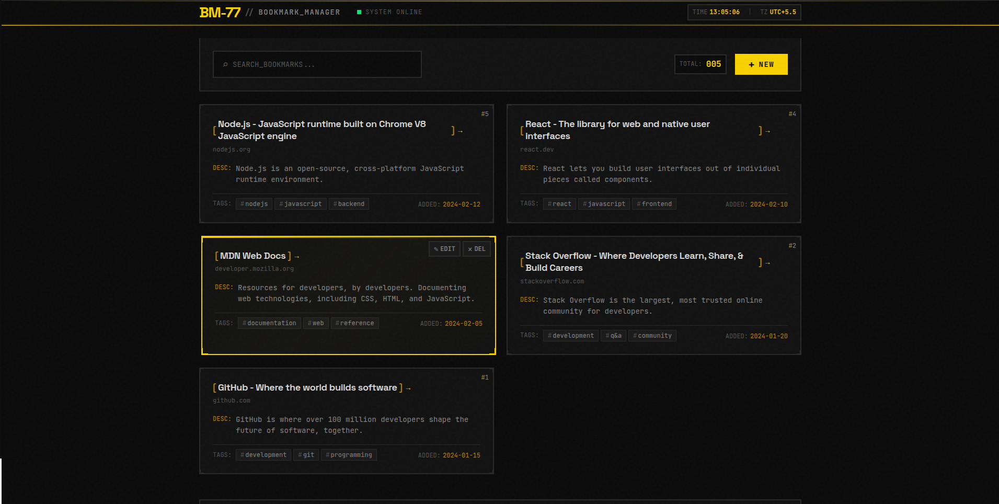

# BM-77 Bookmark Manager

> **Deployment Note**: Backend is deployed on Render free tier. Free tier instances spin down after 15 minutes of inactivity and take 30-60 seconds to wake up on the first request. Subsequent requests will be fast.

A bookmark manager to save, organize, and search your favorite links. Features include tagging, real-time search, and a brutalist-industrial dark theme UI.



## Tech Stack

- **Frontend**: React + TypeScript + Vite
- **Backend**: Express + TypeScript (in-memory storage)
- **Styling**: Custom CSS (no framework)

## Quick Start

```bash
npm run install:all   # Install dependencies
npm run dev           # Start both services
```

- **Backend**: http://localhost:3001
- **Frontend**: http://localhost:5173

## API Endpoints

| Method | Endpoint | Description |
|--------|----------|-------------|
| GET | `/api/bookmarks` | List all bookmarks |
| POST | `/api/bookmarks` | Create bookmark |
| PUT | `/api/bookmarks/:id` | Update bookmark |
| DELETE | `/api/bookmarks/:id` | Delete bookmark |

## License

MIT
